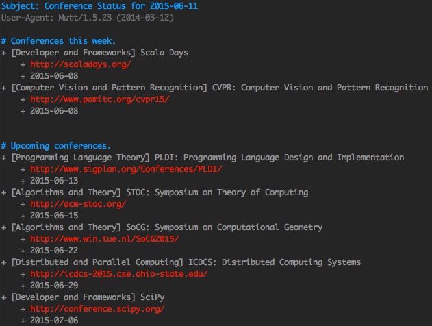

**[Subscribe for Weekly Emails](https://groups.google.com/forum/#!forum/cs-conference-tracker)**

Crafted by [Brandon Amos](http://bamos.github.io).

---

This repository contains my minimal-maintenance conference tracker,
which contains my opinionated list of CS conferences I track.
I find this slightly easier than keeping the dates on Google Calendar
because I can glance at the entire list, keep track of URLs,
and add reminders when I need to add next year's conference.

# Project Structure
The Python source in [report.py](report.py) generates a plaintext
report from the [YAML data](./data).
I have a [Cron](https://en.wikipedia.org/wiki/Cron) job send
weekly emails with [email-report.sh](email-report.sh).

# Adding and Updating Data
As conferences pass and the data becomes outdated,
I'm happy to accept pull requests with updated data.
If you want to track yours by adding/removing conferences,
please fork this repo.
I'm happy to include a list of forks here.

# Lists of Conferences
+ [Wikipedia](https://en.wikipedia.org/wiki/List_of_computer_science_conferences)
